# OrderFlow — Diagramas de Fluxo e Mensageria

> Documentação visual completa da arquitetura de mensageria — **100% Kafka**, sem RabbitMQ.

---

## Índice

1. [Visão Geral da Arquitetura](#1-visão-geral-da-arquitetura)
2. [Ciclo de Vida do Pedido (State Machine)](#2-ciclo-de-vida-do-pedido)
3. [Fluxo Completo — Sequência de Ponta a Ponta](#3-fluxo-completo--sequência-de-ponta-a-ponta)
4. [Tópicos Kafka](#4-tópicos-kafka)
5. [Fluxo Kafka em Detalhe](#5-fluxo-kafka-em-detalhe)
6. [Eventos de Domínio Internos (Spring Events)](#6-eventos-de-domínio-internos-spring-events)
7. [Hierarquia de Classes — Abstrações CRUD](#7-hierarquia-de-classes--abstrações-crud)
8. [Dependências entre Módulos](#8-dependências-entre-módulos)
9. [Fluxo de Dados no MongoDB](#9-fluxo-de-dados-no-mongodb)

---

## 1. Visão Geral da Arquitetura

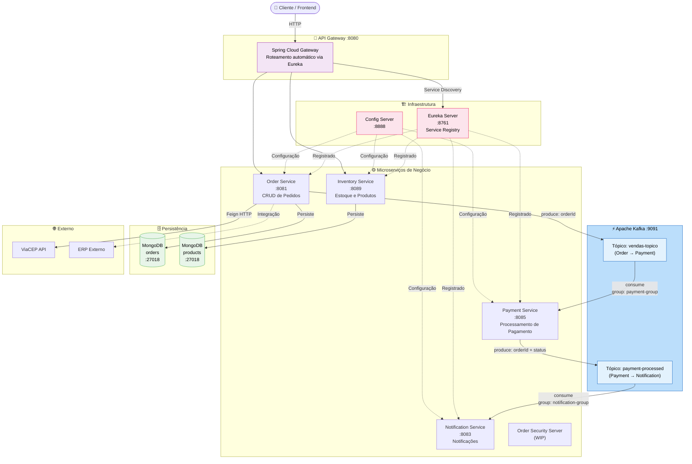

---

## 2. Ciclo de Vida do Pedido

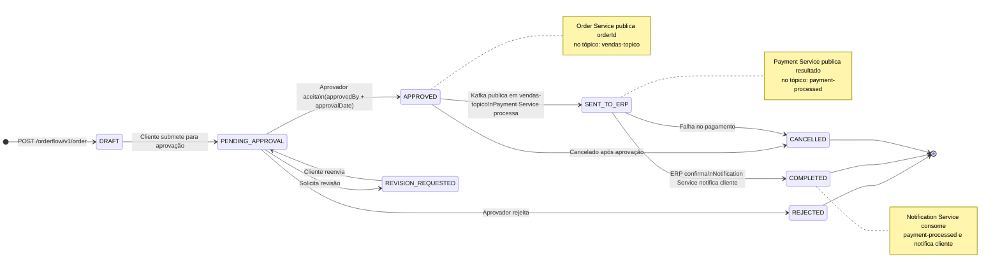

---

## 3. Fluxo Completo — Sequência de Ponta a Ponta

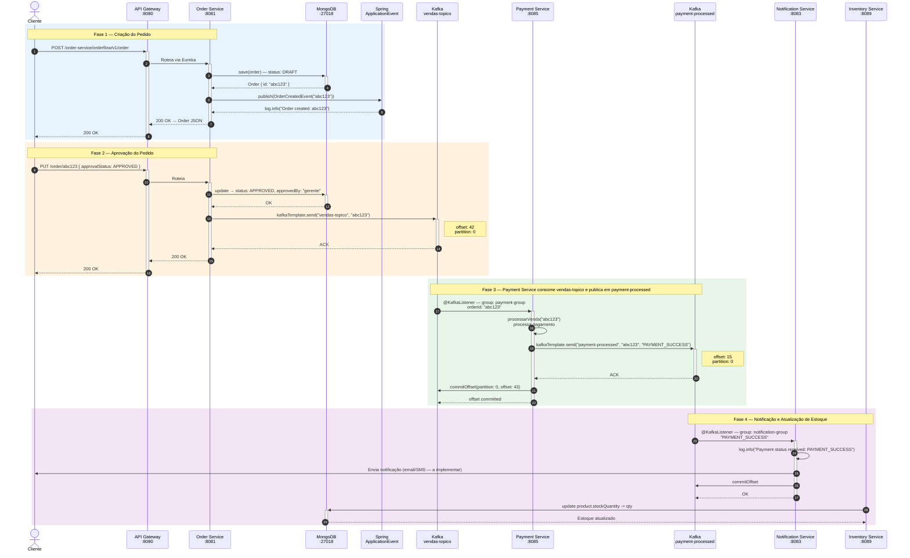

---

## 4. Tópicos Kafka

| Tópico | Producer | Consumer (group) | Payload | Finalidade |
|---|---|---|---|---|
| `vendas-topico` | Order Service | Payment Service (`payment-group`) | `orderId` (String) | Dispara processamento de pagamento ao aprovar pedido |
| `payment-processed` | Payment Service | Notification Service (`notification-group`) | `orderId:status` (String) | Notifica resultado do pagamento |

### Por que dois tópicos e não um?

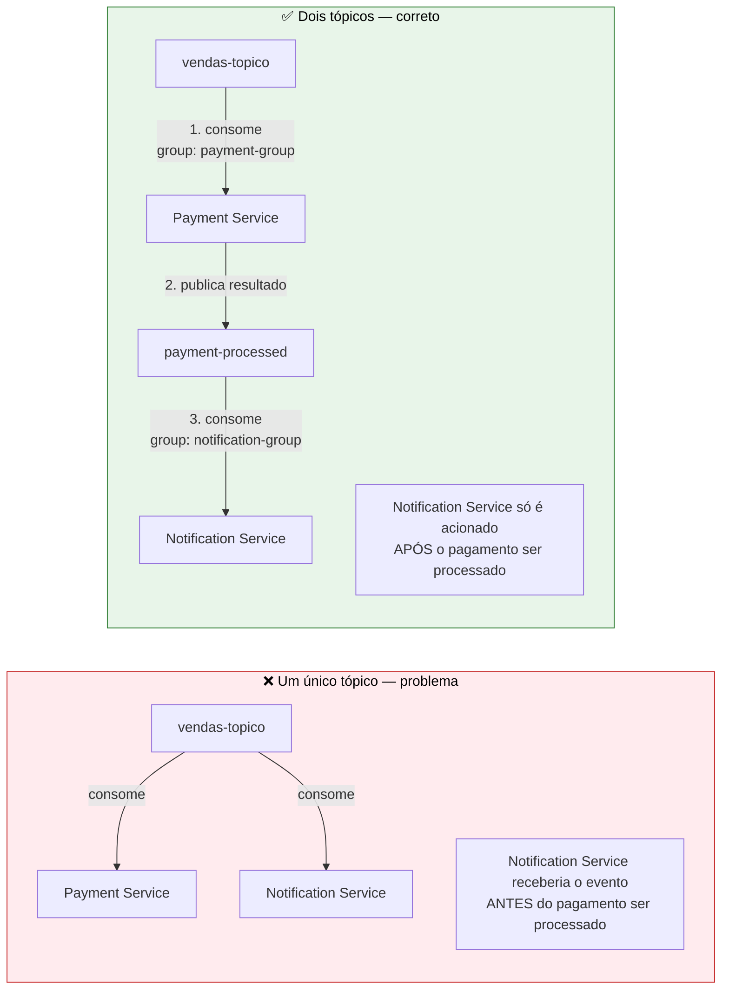

---

## 5. Fluxo Kafka em Detalhe

### 5.1 Arquitetura interna do cluster

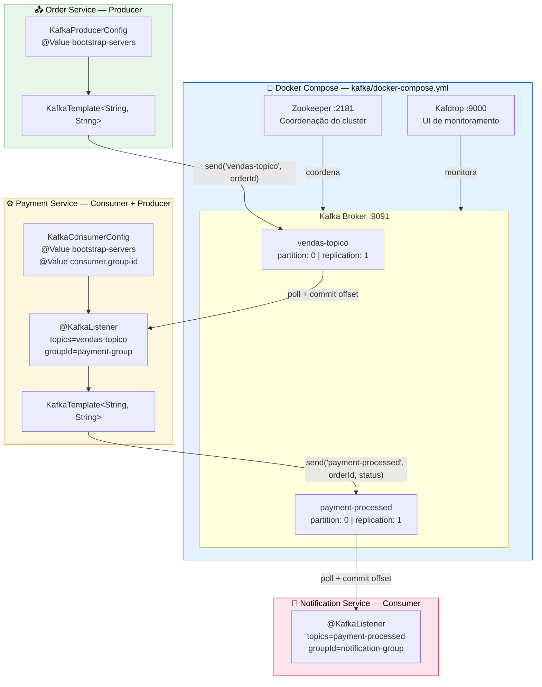

### 5.2 Consumer Groups — por que são independentes

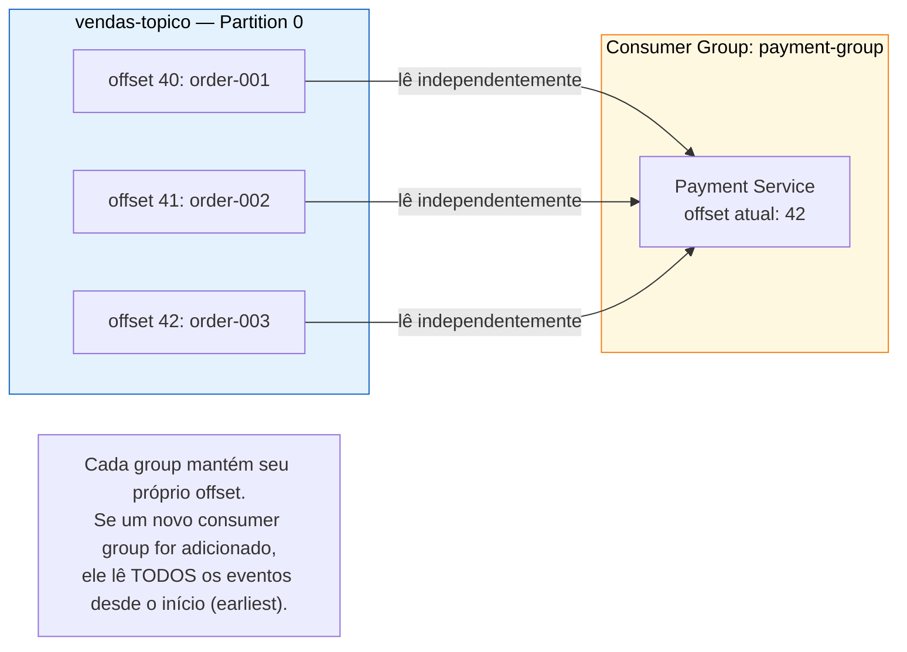

### 5.3 Configuração Producer vs Consumer via application.yml

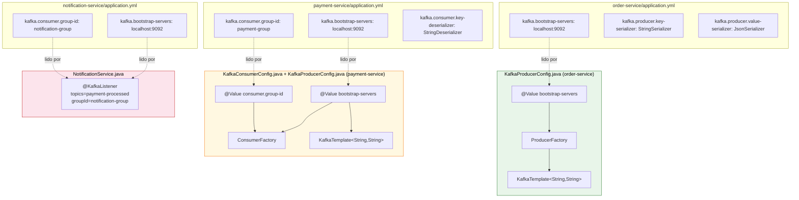

---

## 6. Eventos de Domínio Internos (Spring Events)

Eventos síncronos dentro da JVM do `order-service`, sem rede.

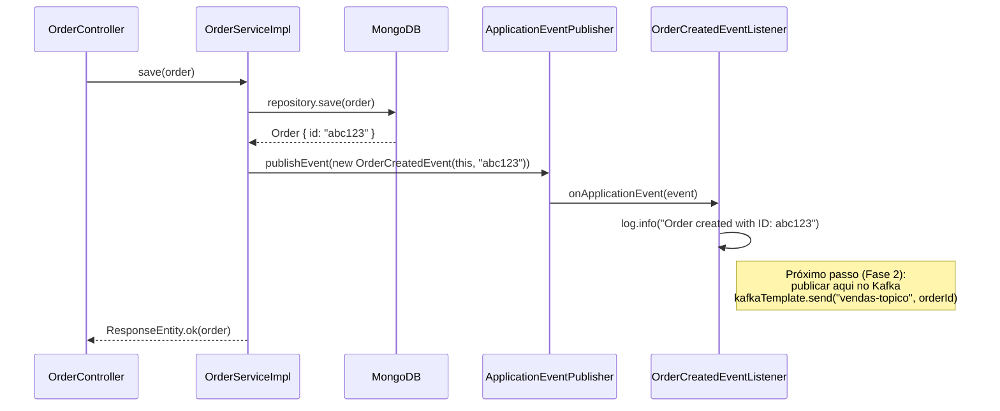

### Hierarquia de Classes — Spring Events

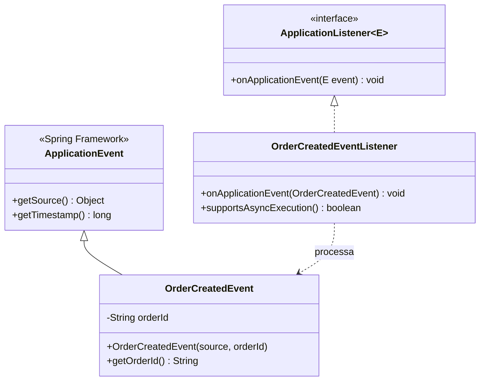

---

## 7. Hierarquia de Classes — Abstrações CRUD

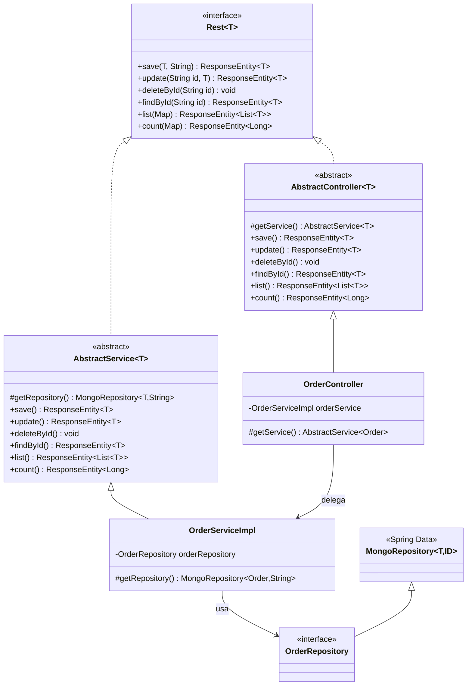

---

## 8. Dependências entre Módulos

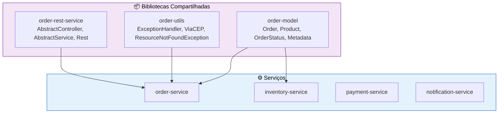

---

## 9. Fluxo de Dados no MongoDB

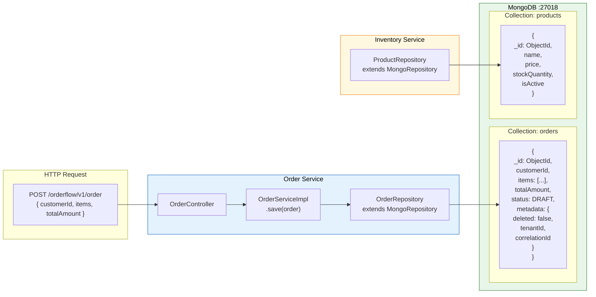

---

## Resumo da Arquitetura de Mensageria

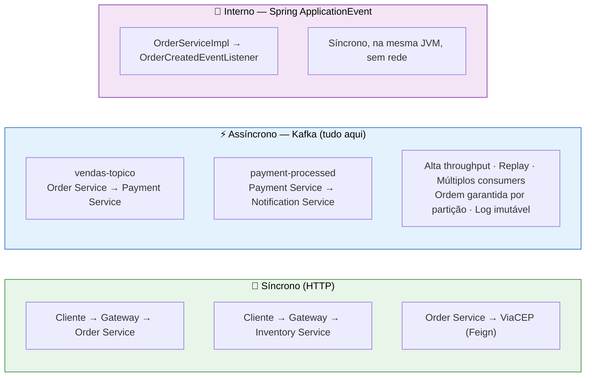

---

*Documento atualizado em: 2026-03-18*
*Para visualizar: VS Code (Mermaid Preview), GitHub, ou [mermaid.live](https://mermaid.live)*
